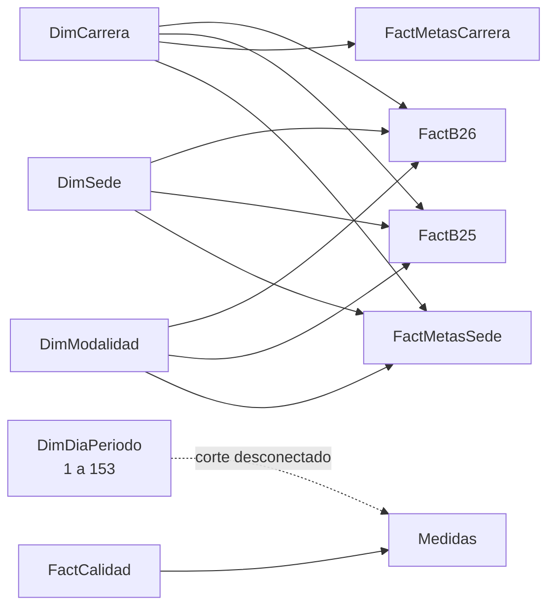

# Modelo Power BI de admisiones

## Fuentes

El modelo importa directamente estas hojas y evita incluir datos personales:

- `615.xlsx`, hoja `reporte`: candidatos B26 con `Periodo = B26`, `HOMOLOGA = NO` y `MATRICULA EN PRIMERO = SI`.
- `Datoshistoricob25.xlsx`, hoja `Hoja2`: matrículas del período B25.
- `Metas.xlsx`, hoja `Hoja1`: meta general por carrera y detalle por sede/modalidad cuando el código de sede es identificable.

El parámetro `SourceFolder` contiene la carpeta de origen. Al mover los archivos, cambie ese parámetro y mantenga los tres nombres de archivo.

## Modelo limpio

- `FactB26` y `FactB25` conservan un registro por fila fuente. No se deduplican personas.
- `CarreraKey` normaliza tildes, mayúsculas y cuatro diferencias conocidas de nombres.
- `FactMetasCarrera` distribuye proporcionalmente 2.400 matrículas sobre las metas originales que suman 2.500, usando restos mayores para mantener enteros y total exacto.
- `DimDiaPeriodo` compara el mismo día transcurrido de mayo a septiembre, 153 días.
- `FactCalidad` calcula conteos de fuente, identificaciones repetidas, filas fuera del período y metas sin sede identificable.

## Matriz de comparación

Las columnas replican la lógica de la matriz de referencia:

- `2025 REAL = 2025 YTD / 2025 TOTAL`
- `2026 YTD = 2026 BUDGET × 2025 REAL`
- `2026 REAL % = 2026 REAL / 2026 YTD`
- `Δ BUDGET = 2026 REAL - 2026 YTD`
- `COMPLETION = 2026 REAL / 2026 BUDGET`
- `REAL VS LY = 2026 REAL / 2025 YTD`
- `VARIANZA = 2026 REAL - 2025 YTD`

`2025 Δ%` permanece en blanco porque los tres archivos entregados no contienen B24. Los valores negativos usan formato rojo.

## Actualización

1. Abra `panelAdmisiones.pbip` con Power BI Desktop.
2. Revise `SourceFolder` en **Transformar datos > Administrar parámetros**.
3. Pulse **Actualizar**.
4. Guarde el proyecto para conservar la caché local y cualquier ajuste visual hecho en Desktop.
